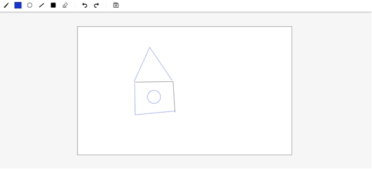

-----

# Collaborative Canvas: Real-time Drawing App

Интерактивный онлайн-холст для совместного рисования в реальном времени. Проект построен на базе WebSockets, что позволяет множеству пользователей одновременно создавать графический контент на одном полотне.

В ближайшем будущем проект будет трансформирован в полноценную многопользовательскую игру на базе рисования и угадывания слов.

## Скриншоты приложения

| Игровой холст (Текущая версия) |
|:---:|
|  |

-----

## Технологический стек

  * **Frontend:** React, TypeScript.
  * **Сборка:** Vite.
  * **Работа с графикой:** HTML5 Canvas API.
  * **Real-time связь:** WebSockets (Socket.io).
  * **State Management:** React Hooks / Context API.
  * **Styling:** CSS-in-JS или SCSS (BEM).

-----

## Ключевые особенности

### Совместное творчество

  * **Мгновенная синхронизация:** Все линии и изменения отображаются у всех подключенных пользователей без задержек.
  * **Инструменты рисования:** Выбор цвета, настройка толщины кисти и ластик.

### Техническая реализация

  * **WebSocket Protocol:** Оптимизированная передача координат для плавного отображения линий.
  * **Бродкастинг событий:** Сервер эффективно распределяет потоки данных между активными сессиями.
  * **Адаптивность:** Полноэкранный режим рисования, корректно работающий на разных разрешениях мониторов.

-----

## Запуск проекта

### 1\. Подготовка

Убедитесь, что у вас установлены:

  * **Node.js** (v20+)
  * **npm** или **yarn**

### 2\. Установка и запуск

1.  Клонируйте репозиторий:
    ```bash
    git clone https://github.com/твой-логин/canvas-app.git
    cd canvas-app
    ```
2.  Установите зависимости:
    ```bash
    npm install
    ```
3.  Запустите проект в режиме разработки:
    ```bash
    npm run dev
    ```

*Примечание: Для работы мультиплеера убедитесь, что запущен серверный модуль (находится в директории `/server`).*

-----

## План развития (Roadmap)

1.  **Игровая механика:** Реализация системы раундов и ролей (рисующий/угадывающие).
2.  **Чат:** Встроенный текстовый чат для ответов и общения.
3.  **Комнаты:** Создание приватных лобби для игры с друзьями по ссылке.
4.  **Таймер и очки:** Система автоматического подсчета баллов за угаданные рисунки.
5.  **Сохранение:** Возможность экспорта финального шедевра в формат PNG.

-----
